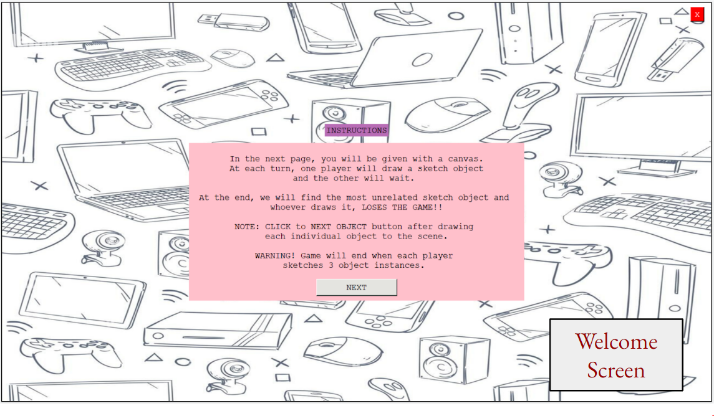

# Sketch_Game_IUI
- **Title:** Sketch Game: Why is this object here?
- **Author:** Aleyna Kütük

## Abstract

Sketching is a natural way of communication for expressing a concept or an idea. However, objects in the drawings tend to be ambiguous standalone and may have different meanings depending on the environment they are sketched in. For instance, while a rectangular object in a sketch may correspond to a paper if it is sketched above a desk, it may also represent a screen or frame in different contexts. This project aims to design a game interface where users will be asked to sketch a scene and place an additional item which normally does not belong to that environment. Each sketch object class will be identified in terms of probabilities of being sketched together in the same scene context. Then, the most unrelated sketch object in that specific context will be selected at the end as an answer to the user. While the proposed model tries to find that particular object, it indirectly learns the properties of the environment through the combination of other sketched objects. In that way, the model will benefit from topic modeling by leveraging linguistic relations between the pairwise object classes in the sketched scene. In conclusion, this project will be a great contribution to the sketch recognition field in the scene understanding tasks and it may be a pioneer study for combining topic modeling with context aided sketch recognition.

## Interface

## Methodology

In this project, the designed sketch game interface will return the most unrelated sketch object given a scene. Users will sketch multiple objects to the canvas and one of them will be unrelated to the context of that scene. The proposed classifier model will assign multiple classes to each object present. Then, the topic modeling will be used to determine the object relations by using linguistic pairwise frequencies of the classes. The most unrelated sketch object will be identified by the surrounding objects through the topic modeling module and will be displayed to the users on the screen. Users will be able to see the prediction of the interface and check whether the prediction is correct or not. Moreover, the list of classes will be shown to the users for each object they sketch. Hence, they may check the correctness of our classifier for the evaluation of the multi-label sketch classification module.

## Frameworks Used

- **Interface:** Tkinter
- **Classifier:** [Sketchformer](https://github.com/leosampaio/sketchformer)
- **Topic Modeling:** TBA